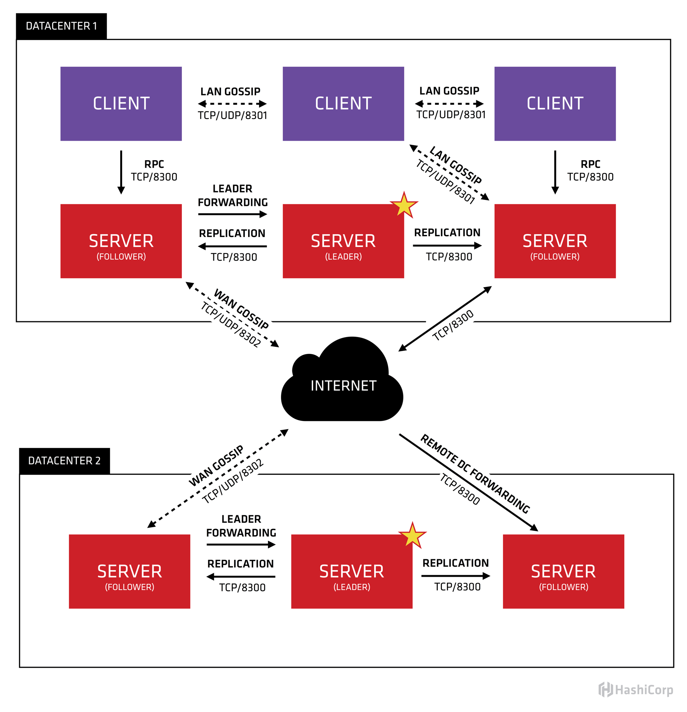

  <h1 align="center">Consul 服务网络解决方案</h1>
  

    <a href="README.md"><strong>English</strong></a> | <strong>简体中文</strong>
  

## 目录

- [仓库简介](#项目介绍)
- [前置条件](#前置条件)
- [镜像说明](#镜像说明)
- [获取帮助](#获取帮助)
- [如何贡献](#如何贡献)

## 项目介绍
‌[Consul‌](https://github.com/hashicorp/consul) Consul 是 HashiCorp 公司开发的一款开源工具，主要用于服务发现、配置管理和服务网格（Service Mesh）功能。它采用分布式架构，基于 Raft 协议保证一致性，支持多数据中心部署，广泛应用于微服务和云原生场景。

**核心特性：**
1. 服务发现与健康检查：支持多种服务发现机制（DNS、HTTP API、Kubernetes、AWS等），动态注册和注销服务实例。内置健康检查功能，主动监控服务状态（如HTTP/TCP/脚本检查），自动从流量中剔除不健康节点，确保服务可用性。
2. 键值存储（KV Store）：提供分布式、高可用的键值存储，支持一致性读写（通过Raft协议保证CP特性）。适用于动态配置存储、特性开关或协调元数据，支持TTL过期和原子操作。
3. 多数据中心支持：原生支持多数据中心部署，数据中心间通过WAN Gossip协议通信，实现跨区域服务发现和故障隔离。支持本地数据中心优先的路由策略，提升跨机房访问效率。
4. 服务网格集成：与Envoy等代理深度集成，提供服务网格数据平面（如xDS API），动态下发负载均衡和流量控制规则。支持金丝雀发布、蓝绿部署等高级流量管理场景。
5. 访问控制与安全：提供ACL（访问控制列表）和令牌系统，细粒度控制服务/键值的读写权限。支持TLS加密通信和mTLS双向认证，保障数据传输安全。
6. DNS/HTTP双接口：通过DNS或HTTP API查询服务，兼容传统DNS架构和现代微服务架构。例如，web.service.consul可解析到健康的Web服务IP列表。
7. 高可用与一致性：基于Raft协议实现强一致性，支持Leader选举和数据复制，容忍节点故障（N/2+1存活即可工作）。服务注册和KV存储均支持多副本，避免单点故障。
8. 轻量级与可扩展：单一二进制部署，无外部依赖，支持容器化（如Docker/Kubernetes）。提供丰富的API和插件机制，易于与Prometheus、Vault等工具集成。
9. 网络自动化：支持Connect功能（服务间TLS加密和身份认证），自动生成和轮换证书，实现零信任网络。可替代传统VPN，简化安全通信配置。
10. 监控与观测集成：内置Prometheus指标端点，暴露集群状态和性能数据（如Raft事务数、健康检查状态）。与Grafana、OpenTelemetry等工具集成，可视化服务拓扑和性能指标。

本项目提供的开源镜像商品 [**`Consul-服务网络解决方案`**]()，已预先安装 Consul 软件及其相关运行环境，并提供部署模板。快来参照使用指南，轻松开启“开箱即用”的高效体验吧。

**架构设计：**

> **系统要求如下：**
> - CPU: 4vCPUs 或更高
> - RAM: 16GB 或更大
> - Disk: 至少 50GB

## 前置条件
[注册华为账号并开通华为云](https://support.huaweicloud.com/usermanual-account/account_id_001.html)

## 镜像说明

| 镜像规格                                                                                                                       | 特性说明 | 备注 |
|----------------------------------------------------------------------------------------------------------------------------| --- | --- |
| [Consul1.17.0-arm-v1.0](https://github.com/HuaweiCloudDeveloper/consul-image/tree/Consul1.17.0-arm-v1.0?tab=readme-ov-file) | 基于鲲鹏服务器 + Huawei Cloud EulerOS 2.0 64bit 安装部署 |  |

## 获取帮助
- 更多问题可通过 [issue](https://github.com/HuaweiCloudDeveloper/consul-image/issues) 或 华为云云商店指定商品的服务支持 与我们取得联系
- 其他开源镜像可看 [open-source-image-repos](https://github.com/HuaweiCloudDeveloper/open-source-image-repos)

## 如何贡献
- Fork 此存储库并提交合并请求
- 基于您的开源镜像信息同步更新 README.md